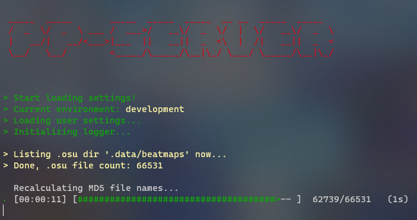
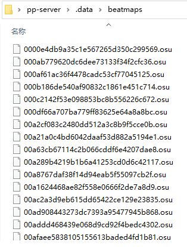

## A Fast osu! pp calculator web api written in Rust

It is also the PP server of **[Peace](https://github.com/Pure-Peace/peace)**.

**Pure-Rust** pp calculator based on [peace-performance](https://github.com/Pure-Peace/peace-performance) and [rosu-pp](https://github.com/MaxOhn/rosu-pp).

### Features

- **Common**:
  - **request beatmap from osu!api**
  - **pp calculate**:
    - osu!Standard
    - Catch the beat
    - Taiko
    - Mainia
- Enable feature **peace**:
  - beatmap database (needs setup with [Peace](https://github.com/Pure-Peace/Peace/tree/main/sql))
  - How to enable?
    - `Cargo.toml` Set `default = []` => `default = ["peace"]`
  
## Note

**This pp-server requires all `.osu` files use file MD5 as the name.**

- **Rename .osu files to file md5:**

  - If you want **pp server** auto recalculate all `.osu` files MD5 name before started, set `recalculate_osu_file_md5 = true` in `pp-server-config/default.toml`
  - Or manual run this python script `rename_osu_files.py` in project (python3.8+).
  - If its Debug compile, python will more faster than Rust.

- **Effect**
  - Calculating
  - 
  - After
  - 

### Setup

1. Set your `.osu` files dir path in `pp-server-config/default.toml`
2. Will let the `.osu` files name be the `md5` of the file

### Debug

```
cargo run
```

### Release

```
cargo run --release
```

**Cross compile (Win to Linux)**

```
cargo cross_linux_x86
```

## MIT
